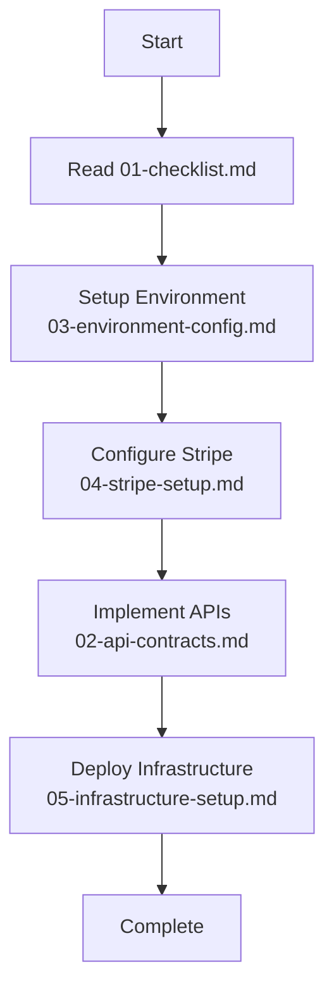

# Implementation Documentation

This folder contains all technical implementation documentation for the Framer Template Platform. Each document includes specific MCP tool references where applicable.

## Document Structure

### 📋 [01-checklist.md](./01-checklist.md)

**Purpose**: Step-by-step implementation checklist organized by development phases
**MCP Tools**: References Task Manager for tracking implementation progress
**Use When**: Starting development, tracking progress, ensuring nothing is missed

### 🔌 [02-api-contracts.md](./02-api-contracts.md)

**Purpose**: Complete API endpoint specifications with request/response contracts
**MCP Tools**: Can be imported into Strapi MCP for automatic endpoint generation
**Use When**: Implementing API endpoints, writing tests, documenting APIs

### 🔐 [03-environment-config.md](./03-environment-config.md)

**Purpose**: All environment variables and configuration settings
**MCP Tools**: Use with Desktop Commander for env file management
**Use When**: Setting up local/staging/production environments

### 💳 [04-stripe-setup.md](./04-stripe-setup.md)

**Purpose**: Stripe products, prices, webhooks, and payment flow configuration
**MCP Tools**: Integrates with Stripe MCP for product/price creation
**Use When**: Configuring payment system, setting up billing

### 🧱 [05-infrastructure-setup.md](./05-infrastructure-setup.md)

**Purpose**: Complete deployment and infrastructure configuration
**MCP Tools**: Uses Docker MCP for containerization and Kubernetes setup
**Use When**: Deploying to staging/production, setting up CI/CD

### 🧩 [06-composer-pattern-guide.md](./06-composer-pattern-guide.md)

**Purpose**: Demonstrates the anti-pattern-to-composition refactor for complex UI (Slack-style composer)
**MCP Tools**: None directly—intended for implementation patterns alongside React tooling
**Use When**: Building front-end messaging workflows, avoiding boolean-prop bloat, onboarding new engineers to the compositional approach

## Additional Required Reading

These documents live outside the implementation folder but are mandatory context for anyone building the platform:

- [Platform Implementation Spec](../platform-implementation-spec.md) — System architecture, data models, backend flows
- [Platform User Flows](../platform-user-flows.md) — End-to-end UX journeys, quota states, and persona coverage
- [Platform UI Design](../platform-ui-design.md) — Visual language, component specs, and accessibility requirements

## Implementation Flow



## MCP Tool Integration Points

### Task Management

- Use `mcp__taskmaster-ai__parse_prd` to generate tasks from platform specs
- Use `mcp__taskmaster-ai__expand_task` for detailed subtasks
- Track progress with `mcp__taskmaster-ai__set_task_status`

### Strapi Development

- Use `mcp__strapi-mcp__create_content_type` for collections defined in specs
- Use `mcp__strapi-mcp__upload_media_from_path` for template files
- Configure webhooks with `mcp__strapi-mcp__create_entry`

### Stripe Integration

- Use `mcp__stripe__create_product` for products in 04-stripe-setup.md
- Use `mcp__stripe__create_price` for pricing tiers
- Test with `mcp__stripe__create_payment_link`

### Infrastructure

- Use `mcp__MCP_DOCKER__docker` for containerization
- Use `mcp__MCP_DOCKER__kubectl_*` for Kubernetes deployment
- Monitor with `mcp__MCP_DOCKER__exec_in_pod` for debugging

### Development Workflow

- Use `mcp__MCP_DOCKER__start_process` for local services
- Use `mcp__MCP_DOCKER__read_file` for configuration files
- Track changes with git integration in main workflow

## Quick Start Commands

```bash
# 1. Initialize Task Manager
mcp__taskmaster-ai__initialize_project --projectRoot $(pwd)

# 2. Parse implementation docs into tasks
mcp__taskmaster-ai__parse_prd \
  --input docs/platform-implementation-spec.md \
  --output .taskmaster/tasks/implementation.json

# 3. Setup local environment
cp docs/implementation/03-environment-config.md .env.example
mcp__MCP_DOCKER__write_file --path .env.local --content "..."

# 4. Start development services
docker-compose up -d postgres redis
yarn dev

# 5. Create Stripe products (use stripe-setup.md)
mcp__stripe__create_product --name "Solo Plan" ...
```

## Implementation Order

1. **Week 1**: Infrastructure & Environment

   - Set up databases and cloud services
   - Configure environment variables
   - Initialize Stripe products

2. **Week 2-3**: Backend Development

   - Create Strapi collections
   - Implement authentication
   - Build API endpoints per contracts

3. **Week 3-4**: Frontend Development

   - Implement UI components
   - Connect to APIs
   - Add authentication flows

4. **Week 5**: Integration & Testing

   - Stripe webhook integration
   - End-to-end testing
   - Performance optimization

5. **Week 6**: Deployment
   - Deploy to staging
   - Production deployment
   - Monitor and optimize

## File Naming Convention

- `01-` through `05-` prefix indicates reading order
- Each file is self-contained but references others where needed
- MCP tool commands are highlighted in code blocks
- Environment-specific sections are clearly marked

## Getting Help

1. Check the relevant implementation document
2. Use Task Manager to track blockers
3. Reference the main platform specs in parent directory
4. Use MCP research tool for specific technical questions

## Updates

These documents should be updated when:

- New features are added to platform specs
- Infrastructure choices change
- MCP tools are added or updated
- Implementation discovers new requirements

Last Updated: 2024-01-19
